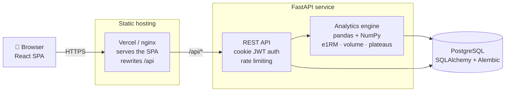

# Gym Tracker

[](https://github.com/danialco9/Proyecto--rutina-del-gym/actions/workflows/backend-ci.yml)
[](https://github.com/danialco9/Proyecto--rutina-del-gym/actions/workflows/frontend-ci.yml)

Web app to log gym workouts, track body measurements and use data analysis to decide when to
change routines, exercises or intensity.

**[Live demo](https://gym-tracker-two-beta.vercel.app)** — press *Probar la demo* to sign in to an
account with 12 weeks of simulated training. No sign-up needed.

> Personal project and portfolio piece. The interface is in Spanish; the code, commits and docs are
> in English. Single user for now, designed to grow into multi-user.

## What it does

- **Live workout logging.** Mobile-first screen built for the gym floor: big `±2.5 kg` / `±1 rep`
  buttons, the previous performance of each exercise in view, a rest timer, and a draft kept in
  `localStorage` so a lost connection or a locked phone never loses a set.
- **Routines with per-set targets.** Each exercise carries ordered set rows (reps, weight, optional
  RPE), so pyramids and ramps are described exactly and prefill the next workout. Drag to reorder,
  with keyboard support.
- **Logging a workout in plain language.** Type (or dictate with the phone keyboard) `prensa 4x10
  120, press banca 12,10,8 a 60 rpe 8` and the server reads it into sets, matched against your
  exercise catalog. It never saves on its own: the reading prefills the workout screen for you to
  review. Where the text genuinely fits more than one exercise - `press banca` is both the barbell
  and the dumbbell entry - it offers the candidates instead of guessing, since the wrong one
  quietly spoils the history.
- **Installable on the phone.** A PWA: added to the home screen it opens standalone, and the app
  shell is precached by a service worker, so it starts with no connection at all. Once you have
  signed in on that device it opens straight into the app offline, on the last session the server
  confirmed, instead of a login page it cannot submit. The API itself is never cached — a stale
  workout is worse than an honest error — so the screens say when they are offline. A workout
  finished with no coverage waits in a queue on the phone and is sent on its own when the
  connection returns; it carries a client id, so a retry after a lost answer is never saved twice.
- **Body measurements.** Quick weight entry plus an optional full set of measurements, with history
  and a weight trend chart.
- **Progress dashboard.** Estimated 1RM per exercise, weekly hard sets by muscle group, personal
  records and body weight trend.
- **Training recommendations.** The analytics engine compares the sets you actually did against the
  ones the routine planned: everything hit at RPE ≤ 8 suggests `+2.5 kg` on every planned set
  (keeping the pyramid shape), missed reps suggest holding, and a detected plateau suggests a deload.

## Architecture



The SPA and the API are served from the same origin on purpose: the session JWT travels in an
`HttpOnly`, `Secure`, `SameSite=Lax` cookie, which a cross-site frontend could not send. In
production Vercel rewrites `/api` to the Render service; in Docker Compose nginx does the same.

## Stack

| Area | Technology |
| --- | --- |
| Frontend | React 19, TypeScript, Vite, Tailwind CSS, shadcn/ui, TanStack Query, React Router, Recharts, vite-plugin-pwa |
| Backend | Python 3.12, FastAPI, SQLAlchemy 2.0 (typed), Alembic, Pydantic |
| Data analysis | pandas, NumPy (scikit-learn planned) |
| Database | PostgreSQL 18 |
| Tooling | uv, Ruff, mypy, pytest · pnpm, oxlint, Prettier, Vitest |
| CI/CD | GitHub Actions · Vercel (web) · Render (API, Docker) · Neon (database) |

## Repository layout

```
backend/    FastAPI service, analytics engine and production Dockerfile
frontend/   React single-page app, nginx image and Vercel config
e2e/        Playwright flows against the full stack
data/       Interim CSV training log
docs/       Deployment guide
docker-compose.yml   Full local stack (PostgreSQL, API, web)
render.yaml          Render Blueprint for the API
```

## Getting started

### Run everything with Docker

Requirements: [Docker](https://docs.docker.com/get-docker/) with Compose.

```bash
docker compose up --build
```

Open http://localhost:8080 and press **Probar la demo**: the demo account comes with 12 weeks of
simulated training. The API docs are at http://localhost:8000/docs.

Compose starts PostgreSQL, the API (it applies the migrations and seeds the exercise catalog and the
demo account on start) and nginx serving the web app and proxying `/api`. It works without a `.env`
file; the defaults are for local use only (see `.env.example` to change passwords or ports).

### Develop with hot reload

Requirements: Docker, [uv](https://docs.astral.sh/uv/), Node.js 24 and pnpm.

```bash
cp .env.example .env          # then set POSTGRES_PASSWORD, GYM_DATABASE_URL and GYM_JWT_SECRET
docker compose up -d --wait db   # start only PostgreSQL

cd backend
uv sync
uv run alembic upgrade head   # create the database schema
uv run gym-admin create-user --email you@example.com
uv run uvicorn gym_tracker.main:create_app --factory --reload   # http://localhost:8000/docs
uv run gym-report             # training report from data/

cd ../frontend
pnpm install
pnpm dev                      # http://localhost:5173
```

### Checks

```bash
cd backend  && uv run ruff check . && uv run mypy . && uv run pytest
cd frontend && pnpm lint && pnpm test && pnpm build
```

Backend tests run against a real PostgreSQL started with testcontainers, so migrations and queries
are exercised the same way they run in production.

The end-to-end flows need the stack running, and drive a phone-sized browser through nginx, the API
and PostgreSQL with nothing mocked ([how a run is set up](e2e/README.md)):

```bash
GYM_RATE_LIMIT_ENABLED=false docker compose up -d --wait --build
cd e2e && pnpm install && pnpm exec playwright install chromium && pnpm test
```

## Engineering notes

A few decisions worth calling out:

- **Auth.** Passwords hashed with Argon2; the session JWT is stored in an `HttpOnly` cookie instead
  of `localStorage`, so a XSS bug cannot read it. Login and registration are rate limited
  (moving window, `429` with `Retry-After`).
- **Schema migrations.** Alembic runs on container start, so a fresh database and a deployed one
  follow exactly the same path.
- **Analytics.** Estimated 1RM (Epley), weekly hard sets per muscle group and plateau detection live
  in a pure module fed either from the CSV log or from PostgreSQL, which keeps it testable without a
  web request.
- **Typing and linting everywhere.** `mypy` on the backend and TypeScript `strict` on the frontend,
  both enforced in CI alongside the tests.

## Roadmap

- [x] Interim CSV training log and analytics engine (e1RM, PRs, weekly volume, weight trend, plateaus, progression)
- [x] App foundation: frontend shell, PostgreSQL in Docker, CI
- [x] Backend API foundation: models, migrations, cookie-based JWT auth, health check
- [x] Backend API: CRUD for exercises, routines, workouts and measurements; exercise catalog seed
- [x] Frontend: login and live workout logging (mobile first, last performance, rest timer, offline draft)
- [x] Account registration
- [x] Frontend: routines screen (create, edit, drag to reorder, per-set targets for pyramids and ramps)
- [x] Frontend: body measurements screen (quick weight entry, weight chart, history)
- [x] Progress analytics API (overview and per-exercise history) and demo account
- [x] Frontend: progress dashboard (recommendations, per-exercise charts, weekly volume, body weight)
- [x] Rate limiting on login and registration
- [x] Deployment setup: Vercel + Render (Docker) + Neon, public demo with nightly reset ([guide](docs/deployment.md))
- [x] One-command local stack with Docker Compose
- [x] End-to-end tests (Playwright) on the full stack, in CI
- [ ] Screenshots in this README
- [x] Workout logging in plain language (rule-based reader, with the seam a language model plugs into)
- [ ] Language-model reading for the sentences the rules cannot reach
- [x] Installable PWA: standalone on the home screen, app shell precached, opens offline on the remembered session
- [x] Offline workout saving: a queue on the phone that syncs when the connection returns, deduplicated by a client id
- [ ] Smarter recommendations
